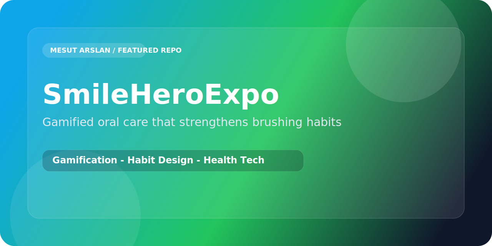

<p align="center">
  
</p>

<p align="center">
  
  
  
</p>

# SmileHeroExpo

`SmileHeroExpo` is a gamified oral care app built to make tooth-brushing feel more engaging, repeatable, and rewarding.

## Why It Works As a Product Idea

- Turns a routine health task into a return-worthy mobile loop
- Supports consistency through playful motivation
- Fits children and family-oriented health education scenarios
- Blends wellness and product design in a very approachable way

## Core Highlights

- Habit-building interaction design
- Notification-ready mobile structure
- Friendly, game-like framing around oral care
- Health-tech angle with broad usability potential

## Stack

- React Native
- Expo
- JavaScript
- Expo Notifications

## Run Locally

```bash
npm install
npx expo start
```
